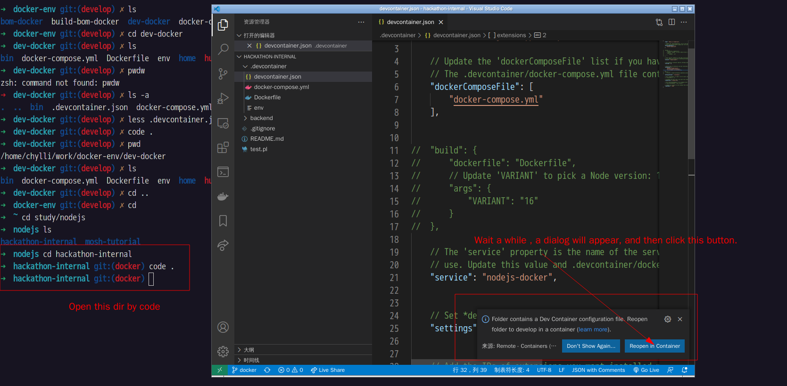

# Usage
Open hackathon-internal by vscode:
```
code hackathon-internal
```

After a while, vscode will display a dialog to ask you whether open this directory in a container, click `yes`

Then a docker container is created and the directory `hackathon-internal` will be mounted to `/workspace`


# Content of docker container
- node v16.5.0
- tsc v4.3.5
- eslint v7.31.0
- [tsserver](https://github.com/Microsoft/TypeScript/wiki/Standalone-Server-%28tsserver%29)
- vscode liveshare plugin
- git
- bash & zsh
- will start a redis v6 container at the same time

# Misc
you can also move this dir `.devcontainer` into other dir and open that dir by code. Then that dir will be mounted 